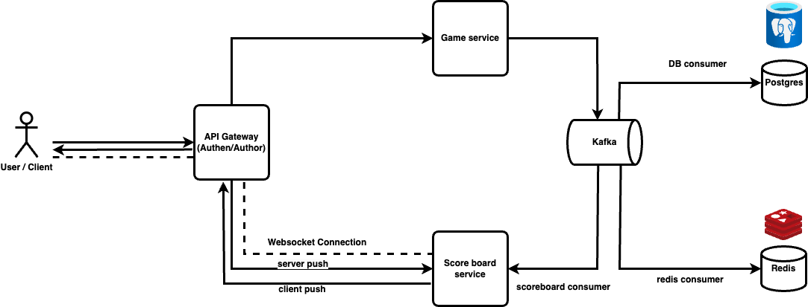

# Score Board Architecture

## 1. Functional requirement.

- Display a score board, which shows the top 10 user’s scores.
- Real-time update score board when something has changed. 
- When a user performs an action (the specifics of which are not important), their score will be incremented.
- Once the action is completed, an API call will be made to the application server to update the user's score.
- Measures must be implemented to ensure that unauthorized users cannot fraudulently increase their scores.

## 2. Non-Functional requirement
- Real-time
- DAU (Daily active user) 5,000,000 DAU / 24x60x60x60 = 50 users every second 
- QPS (Query per second): If each user plays 10 games on average per day, the QPS (Queries Per Second) for score updates would be calculated as follows:
    - Average QPS: 50 users × 10 games = 500 QPS.
    - Peak QPS: 5 times the average QPS = 500 × 5 = 2,500 QPS.

## 3. High-level design
### API Design

#### POST /v1/scores

Update the user's position on the leaderboard when the user wins a game. The request parameters will be as follows:

| **Field** | **Description**                                    |
| --------- | -------------------------------------------------- |
| userId   | userId win game or action                                   |
| points    | Points received                                            |
| actionId    | actionId game or action |

Response:

| **Name** | **Description**     |
| -------- | ------------------- |
| 200      | Update successful |
| 400      | Update failed   |

#### GET /v1/scores

Get top 10 users with higher scores

Response:

```JSON
{
  "data": [
    {
      "userId": "551",
      "username": "Jon",
      "rank": 1,
      "score": 1000
    },
    {
      "userId": "552",
      "username": "Alex",
      "rank": 2,
      "score": 1000
    },
  ],
  "page": 1,
  "total": 10
}
```

### High-level architecture





#### We have architecture with: 
- **Game service**: Verify action and update scores.
- **Score board service**: create and show score board.
- **API gateway**: For authentication and authorization.
- **Kafka**: Asynchronous communicate and building real-time data pipelines.
- **Websocket**: Real-time update score board.

#### Data models

I choose **Redis** and **Postgres**

**Redis** Solutions

We need to find a solution for millions of users and allow us to easily deploy score board operations.
Redis can provide us with a useful solution, as Redis is an in-memory data store that supports key-value pairs. Being in-memory, it supports fast reads and writes.
Redis has a data type called **sorted sets** – which is ideal for solving our problem.

What are sorted sets?
A sorted set is a data type similar to a set. Each element of the sorted set corresponds to a score. The elements of the set are unique, but the scores can be repeated. The score is used to rank the sorted set, and the elements are ordered in ascending order.

Sorted sets are implemented using two data structures:

- Hash table.
- Skip list.

The hash table maps the user to the score, and the skip list maps the score to the user.
In a sorted set, users are ordered by their scores.

##### Implement with Redis sorted sets

For our score board, we will use the following Redis operations:

**ZADD**: Inserts a user into the set if the user does not already exist. Otherwise, it updates the score for the user. This operation takes O(log(n)).
**ZINCRBY**: Increments the user's score. If the user does not exist, it assumes the score starts from 0. This operation takes O(log(n)).
**ZRANGE / ZREVRANGE**: Retrieves a range of users sorted by score. We can specify the order (range vs revrange), the number of entries, and the starting position. This operation takes O(log(n) + m), where m is the number of entries to be retrieved and n is the total number of entries in the set.
**ZRANK / ZREVRANK**: Retrieves the rank of any user in ascending/descending order in logarithmic time.

##### 1.User scores a point

Every month, we will create a leaderboard sorted set, and the previous month's data will be moved to historical data storage. When a user wins a match, they will gain 1 point, so we use ZINCRBY – incrementing the user's score by 1 or adding the user to the leaderboard if they don’t exist. The syntax for ZINCRBY is:

```
ZINCRBY <key> <increment> <user>
```

##### 2. User retrieves the top 10 global score board

We use ZREVRANGE to retrieve members in descending order because we want the highest scores, and we pass the WITHSCORES attribute to ensure that the total score of each user is returned.

```
ZREVRANGE leaderboard_feb_2024 0 9 WITHSCORES
```
The above command will return the top 10 players with the highest scores from the leaderboard_feb_2021 board. The result will be like:

```
[(user2, score2), (user1, score1), ...]
```

**Postgres** Solutions

At a minimum, we need to store the user ID and score. The worst-case scenario is when all 25 million MAU (monthly active users) win at least one game, and every user has entries in the leaderboard for the month. Assuming the ID is a 24-character string and the score is a 16-bit integer, we would need 26 bytes to store each record in the leaderboard.

In the worst case, we need 26 bytes x 25 million = 650 million bytes ~ 650MB for the leaderboard storage in Redis cache. Even if we need double the memory to ensure the skip list, a modern Redis server can still handle this.

Another factor to consider is CPI and I/O usage. The peak QPS here is 2500 updates/s – a single Redis server can handle this load with stable performance.

Redis ensures "permanent" storage, but restarting a Redis instance is quite slow. Typically, Redis is configured with a read replica, and when the main instance fails, the read replica is promoted to the main instance, and a new read replica is added.

Additionally, we need two tables (user and point) in the RDB, similar to **Postgres**. The user table will include user ID and user display name (in practice, there may be more attributes), while the point table will include user ID, score, and the timestamp when the user wins a game.

I choose **Postgres** because it is an advance RDB with high perfomance, effective algorithm sort and left join, scalable, high-consistency.


#### Message queue Kafka

Kafka receives changes from producers, such as game service updates on user points, and consumers like the DB consumer, Redis consumer, and scoreboard consumer will receive these events to store and process the data.

Kafka with high throughput suitable with scaling in the future with multi player game.

#### Websocket

Set up WebSocket connections between the client (browser) and the backend server via API gateway to facilitate two-way, real-time communication.

Initiate WebSocket Connection: Clients initiate WebSocket connections to the backend server.

When a score update happens, the server broadcasts a WebSocket message to all connected clients, informing them of the new score. Upon receiving the update, clients refresh the scoreboard interface to display the updated scores.

#### API gateway

We have API gateway to authen/author all request or connection with Backend. It's make more security and ensure attacker.
Not only that, API gateway can do: 
- Rate limit request
- Secure WebSocket Communication.
- Input Validation
- Loadbalancing


### 4. Flow

0. **User/Client** establish connection with **websocket** and call API **GET /v1/scores** to get data score board top 10 users.
1. **User/Client** win or do action to increase score call API **POST /v1/scores** to update.
2. Request go through **API gateway** to authenticate.
3. After that **API gateway** will dispatch request to **game service**.
4. **Game service** handle logic and push an event update score for this user/client to Kafka.
5. After kafka receive the message of update score event, 2 consumers of this event are DB consumer and redis consumer will receive the message. 
6. **DB consumer** and **redis consumer** handle update score for user/client.
7. **Redis** will update **sorted sets** to rearrange top 10 users score and update score for this user.
8. After redis update success, **redis** will push an event is score board change to **Kafka**.
9. **Score board service** consumer will receive message when score board change from redis producer and handle update data.
10. After update data, **score board service** will push event update data score board via **websocket**
11. **User/Client** listen event update data score board receive new data.